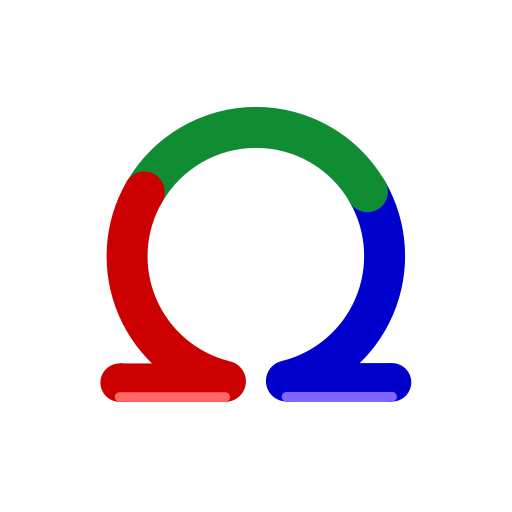

<br>

<div align = center>

[![Badge Stars]][#]   
[![Badge Deno]][Deno]

<br>
<br>



# RGB

*Convert colors to RGB.*

<br>

[![Button Usage]][Usage]   
[![Button Conversions]][Conversions]

<br>
<br>

## Examples

<br>

```JavaScript
import * as RGB from 'https://deno.land/x/rgb/mod.ts';
```

</div>

<br>

### Hex

```JavaScript
const hex = '#0000FF'; // Blue

const rgb = RGB.fromHex(hex);

console.log(rgb); // [ 0 , 0 , 255 ]
```

<br>

### HSL

```JavaScript
const hsl = [ 0 , 100 , 50 ]; // Red

const rgb = RGB.fromHSL(hsl);

console.log(rgb); // [ 255 , 0 , 0 ]
```


<!-- 
<br>

### CMYK

```JavaScript
const cmyk = [ 100 , 0 , 100 , 0 ]; // Green

const rgb = RGB.fromCMYK(cmyk);

console.log(rgb); // [ 120 , 100 , 50 ]
``` -->

<br>


<!----------------------------------------------------------------------------->

[Conversions]: Documentation/Conversions.md
[License]: LICENSE
[Usage]: Documentation/Usage.md
[Deno]: https://deno.land/x/rgb
[#]: #


<!---------------------------------[ Badges ]---------------------------------->

[Badge License]: https://img.shields.io/badge/License-AGPL3-015d93.svg?style=for-the-badge&labelColor=blue
[Badge Stars]: https://img.shields.io/github/stars/OmegaTools/RGB?style=for-the-badge&logoColor=white&logo=Trustpilot&labelColor=FF66AA&color=cf538b
[Badge Deno]: https://img.shields.io/badge/-Deno-58a341?style=for-the-badge&logoColor=white&logo=Deno&labelColor=64bc4b


<!---------------------------------[ Buttons ]--------------------------------->

[Button Conversions]: https://img.shields.io/badge/Conversions-64BC4B?style=for-the-badge&logoColor=white&logo=Betfair
[Button Usage]: https://img.shields.io/badge/Usage-04ACE6?style=for-the-badge&logoColor=white&logo=GitBook
